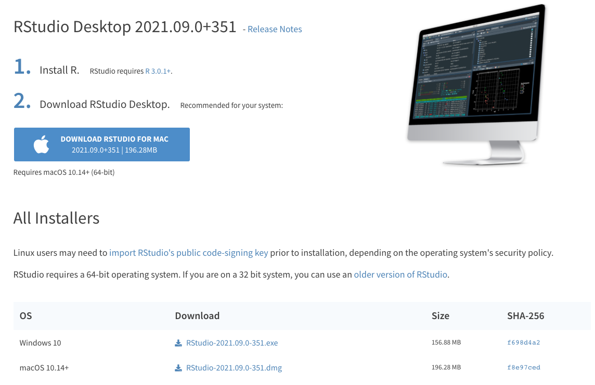
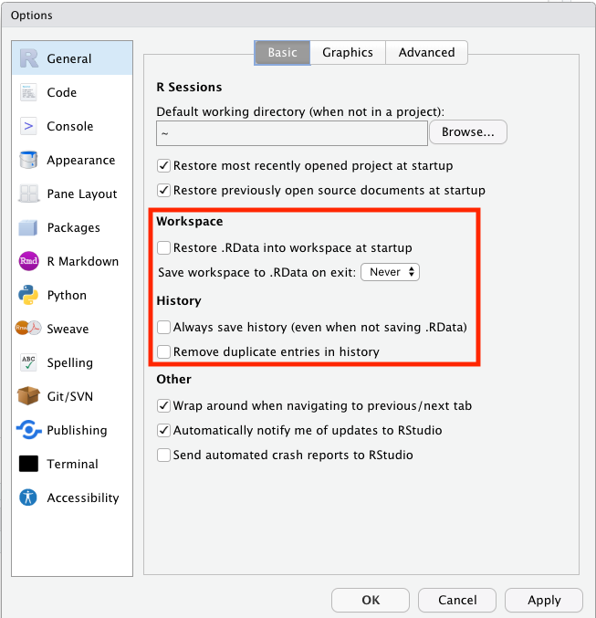

```{r tutorial-1, include=FALSE}
knitr::opts_chunk$set(
	fig.show = "hold",
	comment = "",
	results = "hold"
)
```

```{r tutorial-2, message=F, echo=F}
library("knitr")      # for R Markdown functions 
library("tidyverse")  # for data manipulation and visualization
```

# Getting ready 

## Installing R 

Go on this link to download R: [https://cran.rstudio.com/](https://cran.rstudio.com/)

Select the version that works for your operating system, and download the latest release (R-3.6.0).

```{r tutorial-3, out.width="75%", echo=FALSE, fig.cap="Download R."}
  include_graphics("../../figures/screenshots/r_install.png")
```

Once you've downloaded R, install it following the instructions on the screen. 

## Installing R Studio 

Go on this link to download R Studio: [https://www.rstudio.com/products/rstudio/download/#download](https://www.rstudio.com/products/rstudio/download/#download)

And then download the version that works for your operating system.

```{r tutorial-4, out.width="75%", echo=FALSE, fig.cap="Download R Studio."}
  
```

Once you've downloaded R Studio, install it following the instructions on the screen. 

# Why R? 

- What R is very good at: 
  - data visualiztion
  - data manipulation
  - statistics 
  - project documentation with R Markdown 
- What Python is very good at: 
  - you can do everything with Python (whereas R is a more specialized language)
  - Python is the main language for machine learning (deep learning)
  - you can program experiments in Python 
- Depending on what research you do, I strongly suggest to learn Python, too!
- In my research, I use both languages together. 

## What you already know about R 

```{r tutorial-5, out.width="75%", echo=FALSE, fig.cap="R Survey results."}
  include_graphics("../../figures/plots/r_survey.png")
```


# Setting things up 

## R Studio 

R Studio is a great integrated development environment (IDE) in which you can do all your R coding. 

Before we get started, let's change some of the settings in R Studio first. 

```{r tutorial-6, out.width="50%", echo=FALSE, fig.cap="General preferences."}
  
```

__Make sure that__:

- Restore .RData into workspace at startup is _unselected_
- Save workspace to .RData on exit is set to _Never_

```{r tutorial-7, out.width="50%", echo=FALSE, fig.cap="Code window preferences."}
  
```

This makes sure that each time we run R Studio, we are starting with a fresh environment rather than still having variables saved from a previous run (which can cause trouble). 

__Make sure that__:

- Soft-wrap R source files is _selected_

This way you don't have to scroll horizontally. At the same time, avoid writing long single lines of code. For example, instead of writing code like so:

```{r tutorial-8, eval=FALSE}
ggplot(data = diamonds, aes(x = cut, y = price)) +
  stat_summary(fun.data = "mean_cl_boot", geom = "linerange", size = 1.5) +
  stat_summary(fun.y = "mean", geom = "bar", color = "black", fill = "lightblue", width = 0.85) +
  labs(title = "Price as a function of quality of cut", subtitle = "Note: The price is in US dollars", tag = "A", x = "Quality of the cut", y = "Price")
```

You may want to write it this way instead:

```{r tutorial-9, eval=FALSE}
ggplot(data = diamonds, aes(x = cut, y = price)) +
  # display the error bars
  stat_summary(fun.data = "mean_cl_boot",
               geom = "linerange",
               size = 1.5) +
    # display the means
  stat_summary(fun.y = "mean",
               geom = "bar",
               color = "black",
               fill = "lightblue",
               width = 0.85) +
  # change labels
  labs(title = "Price as a function of quality of cut",
       subtitle = "Note: The price is in US dollars", # we might want to change this later
       tag = "A",
       x = "Quality of the cut",
       y = "Price")
```

This makes it much easier to see what's going on, and you can easily add comments to individual lines of code.

Here is cheatsheet with more useful information about R Studio: 

- [R Studio cheatsheet](../../figures/cheatsheets/rstudio-ide.pdf)

## Getting help

There are a few different ways to get help in R. You can either put a `?` in front of the function you'd like to learn more about, or use the `help()` function.

```{r tutorial-10, eval=FALSE}
?print
help("print")
```

>__Tip__: To see the help file, hover over a function (or dataset) with the mouse (or select the text) and then press `F1`.

I recommend using `F1` to get to help files -- it's the fastest way!

R help files can sometimes look a little cryptic. Most R help files have the following sections (copied from [here](https://www.dummies.com/programming/r/r-for-dummies-cheat-sheet/)):

---

__Title__: A one-sentence overview of the function.

__Description__: An introduction to the high-level objectives of the function, typically about one paragraph long.

__Usage__: A description of the syntax of the function (in other words, how the function is called). This is where you find all the arguments that you can supply to the function, as well as any default values of these arguments.

__Arguments__: A description of each argument. Usually this includes a specification of the class (for example, character, numeric, list, and so on). This section is an important one to understand, because arguments are frequently a cause of errors in R.

__Details__: Extended details about how the function works, provides longer descriptions of the various ways to call the function (if applicable), and a longer discussion of the arguments.

__Value__: A description of the class of the value returned by the function.

__See also__: Links to other relevant functions. In most of the R editors, you can click these links to read the Help files for these functions.

__Examples__: Worked examples of real R code that you can paste into your console and run.

---

Here is the help file for the `print()` function:

```{r tutorial-11, echo=FALSE, fig.cap="Help file for the print() function.", out.width="95%"}
  include_graphics("../../figures/screenshots/help_print.png")
```

The help files in R are often quite cryptic and it can take some time until these are really helpful. Until then, __google things__! R has a very active community with a large number of posts on stackoverflow and other online forums.  

## Installing and maintaining packages 

What makes R powerful is the large number of packages that have been written for R. You can install a new package like so: 

```{r tutorial-12, eval=F}
install.packages("tidyverse")
```

You can also install multiple packages at the same time, by concatenating the package names using the `c()` function: 

```{r tutorial-13, eval=F}
install.packages(c("tidyverse","broom"))
```

To make sure that your packages remain up to date, you can go to `Tools > Check for Package Updates ...` in R Studio. 

```{r tutorial-14, echo=FALSE, fig.cap="Help file for the print() function.", out.width="75%"}
  
```

You can then click `Select All` and then `Install Updates`.

```{r tutorial-15, echo=FALSE, fig.cap="Help file for the print() function.", out.width="50%"}
  include_graphics("../../figures/screenshots/packages_2.png")
```

R Studio might ask you to restart your R session before updating the packages. 

## R Markdown 

R Markdown files are a great way of organizing ones code. This tutorial is written using R Markdown! Most importantly, you can put R code straight into your R Markdown file so that you can have everything in one place. Indeed, you can write a full paper in R Markdown if you like (using the package [papaja](https://github.com/crsh/papaja)).

There are two main ways of putting code into your R Markdown document. Most often, you will create a code chunk and put the code into that chunk, like so: 

```{r tutorial-16}
a = 1 + 2 
print(a)
```

You can also evaluate R code in line with other text like so: The value of `a` is `r a`. 

The nice thing about these code chunks is that they show you the output directly underneath the chunk when you run it. This is also true for plots. This means you can focus on one place rather than needing to shift back and forth between multiple windows. 

And a big advantage of using R Markdown is that you can render the file in different formats by "knitting" it. For example, I've created the ".html" file using this R Markdown file. This is a great way of sharing your code with others and contributing to open science this way. 

You can also use R Markdown to build [academic homepages](https://www.emilyzabor.com/tutorials/rmarkdown_websites_tutorial.html), and to write [online books](https://bookdown.org/yihui/bookdown/). 

You can find some more information about R Markdown in the cheatsheets here: 

- [R Markdown reference](../../figures/cheatsheets/rmarkdown-reference.pdf)
- [R Markdown cheatsheet](../../figures/cheatsheets/rmarkdown.pdf)

## Some general advice 

Before diving into R, here are a few more general tips. 

### Naming folders and files 

I suggest to always use lower case characters and avoid whitespace in folder and file names. Either use "_" or "-" instead of a white space. Some programs (e.g. LaTeX) cannot deal with white spaces in file paths. 

### Always use relative paths 

In your R Markdown file, make sure to always use relative paths rather than full paths. For example, notice how I link to the cheatsheets like so `"../../figures/cheatsheets/rmarkdown-reference.pdf"` (relative path) rather than so `"/Users/tobi/Documents/work/projects_git/r_tutorial/figures/cheatsheets/rmarkdown-reference.pdf"` (absolute path). 

Using relative paths has the advantage that your collaborators can run code just like you can. If you were to use an absolute path, then your collaborator wouldn't be able ot run the file without changing the path first. 

### Naming variables, functions, etc. 

Personally, I like to name things consistently so that I have no trouble finding stuff even when I open up a project that I haven't worked on for a while. I try to use the following naming conventions: 

```{r tutorial-17, echo=FALSE}
name = c(
  "df.thing",
  "l.thing",
  "fun.thing",
  "tmp.thing")
use = c(
  "for data frames",
  "for lists",
  "for functions",
  "for temporary variables")
kable(x = tibble(name, use), 
      caption = "Some naming conventions I adopt to make my life easier.", 
      align = c("l", "l"),
      booktabs = TRUE)
```

### Always load all packages at the top 

This way, other collaborators will directly see what packages they may need to install before running the code. 

### Make sure that a script can be executed from top to bottom 

For example, you don't want it to be the case that in order to run code chunk 2, you have to run code chunk 3 first. 

### Keep your projects organized 

This github repository uses a project structure that I like. I recommend keeping data, figures, and code separate. Using the same structure in different projects really helps to keep things organized, and to find things quickly. 

### Learn keyboard shortcuts! 

Learning keyboard shortcuts will speed up your workflow immensely! You can view the default keyboard shortcuts here: `Tools > Keyboard Shortcuts Help`

You can also modify and add keyboard shortcuts via `Tools > Modify Keyboard Shortcuts...`

For the very eager among, you can also take a look at snippets. Snippets alow you to define code macros for pieces of code that you use often (e.g. particular kinds of plots that you like making). You can find out more about how snippets in R Studio work [here](https://www.infoworld.com/article/3396616/how-to-use-rstudio-code-snippets.html).

### Use R projects 

By using R projects you make sure that the working directory is set correctly. You can then open multiple R projects at the same time without any conflicts between the projects (otherwise, you might overwrite variables from one script with the variables of another script using the same environment). For this tutorial, I've created the `r_tutorial.Rproj` file. 

### Don't write past the vertical rule in code blocks

This way, your code will look nice when you knit your R Markdown file into a html or a pdf output. 

### Keep your code tidy 

```{r tutorial-18, echo=F, fig.cap="Tidy code and data sparks joy!!!"}
include_graphics("../../figures/misc/tidying-up.jpg")
```

This code block here is difficult to read:

```{r tutorial-19, eval=F}
ggplot(df.plot,aes(x = money,
                      y=happiness))+geom_point()+
geom_smooth(method="lm")
```

This code block is much easier to read: 

```{r tutorial-20, eval=F}
ggplot(data = df.plot,
       mapping = aes(x = money,
                     y = happiness)) + 
  geom_point() +
  geom_smooth(method = "lm")
```

- Use consistent indentation. RStudio makes it easy to write nice code. It figures out where to put the next line of code when you press `ENTER`. And if things ever get messy, just select the code of interest and hit `cmd + i` to re-indent the code.
- Use named arguments for functions. For example, write `ggplot(data = df.plot)` instead of `ggplot(df.plot)`. Using argument names makes it easier for others to read your code. Coming from another programming language, you might not get what `seq(1, 11, 2)` means, and it'll be easier to understand `seq(from = 1, to = 11, by = 2)` -- Ah, this is a sequence from 1 to 11 in steps of 2! 
- Use white spaces between names and arguments, and around `+`, `=,` `-`, etc. 
- Always have a line break after `+` in ggplot2 or after using the pipe `%>%` (which we will discuss later). This makes it easier to just run parts of your code if you want to test stuff, and to comment out parts of your code, too. 

Here are some more tips on how to write nice code in R:

- [Advanced R style guide](http://adv-r.had.co.nz/Style.html)

## R syntax 

There are two main ways to code in R, one is called "base R" and the other is called "tidyverse". The "tidyverse" is a collection of powerful packages that work very well with one another It's the modern way of coding in R, and this tutorial uses the tidyverse. That said, it's still important to know how to write things using "base R". 

This cheatsheet summarizes some of the key aspects of "base R"

- [base R cheatsheet](../../figures/cheatsheets/base-r.pdf)

### The pipe `%>%`

A key part of coding in the tidyverse is using the pipe operator `%>%` (pronounce "then"). What's great about the pipe operator is that it allows us to write code in the order which makes sense: first I want to do this with the data, then I want to do that, then I want to print out the result. 

Let me illustrate by calculating the root mean squared error (a measure of how well your predictions fit the data). In case you're interested, this is how RMSE is defined: 

$$
\text{RMSE} = \sqrt\frac{\sum_{i=1}^n(\hat{y}_i-y_i)^2}{n}
$$
where $\hat{y}_i$ denotes the prediction, and $y_i$ the actually observed value.

And here is how to calculate it using standard base R syntax. 

```{r tutorial-21}
prediction = c(1, 3, 4, 5)
data = c(2, 3, 2, 3)

print(sqrt(mean((prediction - data)^2)))
```

Notice, how we have to read what this does from the inside out -- that is, we need to start in the most inside part of the parenthesis the `(model - data^2)` and work our way out. Instead, a more intuitive way of writing the same thing is using the pipe operator like so: 

```{r tutorial-22}
prediction = c(1, 3, 4, 5)
data = c(2, 3, 2, 3)

(prediction - data)^2 %>% 
  mean() %>% 
  sqrt() %>% 
  print()
```

Instead of root-mean-squared error, it should really be called squared-mean-root error! 

Abstractly, the pipe operator does the following: 

> `f(x)` can be rewritten as `x %>% f()`

It takes the output of a previous computation, and inserts this output as the first argument into the next computation. You can learn more about how the pipe works here [https://r4ds.had.co.nz/pipes.html](https://r4ds.had.co.nz/pipes.html).

> __Pro Tip:__ The keyboard shortcut for the pipe is `cmd + shit + m`

# Doing stuff

## Loading packages 

> The order in which packages in R are loaded matters!

```{r tutorial-23, eval=F}
library("tidyverse")
library("MASS")
```

versus 

```{r tutorial-24, eval=F}
library("MASS")
library("tidyverse")
```

Both the `MASS` package and the `tidyverse` packages have a function called `select()`. In R, whichever package is loaded later, overwrites the functions of earlier loaded packages with the same name. 

You can refer to functions from specific packages by adding the package name at the beginning. For example, this command would use the `select()` function from the `MASS` package `MASS::select()`, while this command would use the function from the `dplyr` package `dplyr::select()` (irrespective in which order you've loaded the packages). However, adding the package name to a function each time it's called is cumbersome. That's why we want to make sure to load the packages whose functions we use most frequently last. 

In particular, I'd suggest to always load `library("tidyverse")` last because it loads a large number of often used functions. 

## Importing data 

We can import a comma-separated-value (csv) file like so (you can ignore the `mutate()` part for now): 

```{r tutorial-25, message=F}
df.data = read_csv(file = "../../data/top2018songs.csv") %>% 
  mutate(rank = 1:nrow(.))
```

```{r tutorial-26, echo=F}
tibble(column = c("id",
"name",
"artists",
"danceability",
"energy",
"key",
"loudness",
"mode",
"speechiness",
"acousticness",
"instrumentalness",
"liveness",
"valence",
"tempo",
"duration_ms",
"time_signature"),
description = c("Spotify URI of the song",
"Name of the song",
"Artist(s) of the song",
"Danceability describes how suitable a track is for dancing based on a combination of musical elements including tempo, rhythm stability, beat strength, and overall regularity. A value of 0.0 is least danceable and 1.0 is most danceable.",
"Energy is a measure from 0.0 to 1.0 and represents a perceptual measure of intensity and activity. Typically, energetic tracks feel fast, loud, and noisy. For example, death metal has high energy, while a Bach prelude scores low on the scale. Perceptual features contributing to this attribute include dynamic range, perceived loudness, timbre, onset rate, and general entropy.",
"The key the track is in. Integers map to pitches using standard Pitch Class notation. E.g. 0 = C, 1 = C♯/D♭, 2 = D, and so on.",
"The overall loudness of a track in decibels (dB). Loudness values are averaged across the entire track and are useful for comparing relative loudness of tracks. Loudness is the quality of a sound that is the primary psychological correlate of physical strength (amplitude). Values typical range between -60 and 0 db.",
"Mode indicates the modality (major or minor) of a track, the type of scale from which its melodic content is derived. Major is represented by 1 and minor is 0.",
"Speechiness detects the presence of spoken words in a track. The more exclusively speech-like the recording (e.g. talk show, audio book, poetry), the closer to 1.0 the attribute value. Values above 0.66 describe tracks that are probably made entirely of spoken words. Values between 0.33 and 0.66 describe tracks that may contain both music and speech, either in sections or layered, including such cases as rap music. Values below 0.33 most likely represent music and other non-speech-like tracks.",
"A confidence measure from 0.0 to 1.0 of whether the track is acoustic. 1.0 represents high confidence the track is acoustic.",
"Predicts whether a track contains no vocals. 'Ooh' and 'aah' sounds are treated as instrumental in this context. Rap or spoken word tracks are clearly 'vocal'. The closer the instrumentalness value is to 1.0, the greater likelihood the track contains no vocal content. Values above 0.5 are intended to represent instrumental tracks, but confidence is higher as the value approaches 1.0.",
"Detects the presence of an audience in the recording. Higher liveness values represent an increased probability that the track was performed live. A value above 0.8 provides strong likelihood that the track is live.",
"A measure from 0.0 to 1.0 describing the musical positiveness conveyed by a track. Tracks with high valence sound more positive (e.g. happy, cheerful, euphoric), while tracks with low valence sound more negative (e.g. sad, depressed, angry).",
"The overall estimated tempo of a track in beats per minute (BPM). In musical terminology, tempo is the speed or pace of a given piece and derives directly from the average beat duration.",
"The duration of the track in milliseconds.",
"An estimated overall time signature of a track. The time signature (meter) is a notational convention to specify how many beats are in each bar (or measure).")
) %>% 
  kable(caption = "Description of the different columns in the data frame.")
```

> The quickest way to take a look at your data is to hover your mouse over a variable of a data frame, and press `F2`.

Let's take a look at the top of the data frame: 

```{r tutorial-27}
df.data %>% 
  print()
```

Here is a cheatsheet with more information about how to import data into R: 

- [importing data cheatsheet](../../figures/cheatsheets/data-import.pdf)

## Data visualiztion 

### How not to visualize data 

We should always take a look at the data first. 

```{r tutorial-28, out.width="95%", fig.cap="A not so good plot.", echo=F}

```

```{r tutorial-29, out.width="95%", fig.cap="Another could-be-improved plot.", echo=F}

```

This second plots reminded me of the following: 

```{r tutorial-30, out.width="95%", fig.cap="Correlation is not causation.", echo=F}

```

Just because two lines look similar, doesn't mean that anything interesting is going on -- it certainly doesn't mean that the two phenomena represented by the lines are causally connected. For more inspiration check out this site [https://www.tylervigen.com/spurious-correlations](https://www.tylervigen.com/spurious-correlations). 

### Why you should always visualize your data first

```{r tutorial-31, echo=FALSE, fig.cap="__The Datasaurus Dozen__. While different in appearance, each dataset has the same summary statistics to two decimal places (mean, standard deviation, and Pearson's correlation).", out.width="95%"}
include_graphics("../../figures/plots/datasaurus_dozen.png")
```

The data sets in Figure \@ref(fig:tutorial-31) all share the same summary statistics. Clearly, the data sets are not the same though.

> __Tip__: Always plot the data first!

[Here](https://www.autodeskresearch.com/publications/samestats) is the paper from which I took Figure \@ref(fig:tutorial-31). It explains how the figures were generated and shows more examples for how summary statistics and some kinds of plots are insufficient to get a good sense for what's going on in the data.

```{r tutorial-32, out.width="95%", fig.cap="Boxplots can be misleading.", echo=F}
include_graphics("../../figures/plots/box_violin.gif")
```

### Visualizing data using `ggplot2`

`ggplot2` defines a grammar of graphics. One of the great things is that you can make a variety of different kinds of plots without ever having to change your data frame. 

Here is how you would make a scatter plot: 

```{r tutorial-33}
ggplot(data = df.data,
       mapping = aes(x = danceability,
                     y = valence)) + 
  geom_point()
```

Adding a best-fitting linear regression line to the scatter plot is simple: 

```{r tutorial-34}
ggplot(data = df.data,
       mapping = aes(x = danceability,
                     y = valence)) + 
  geom_point() +
  geom_smooth(method = "lm")
```


Here is a more involved plot that shows some of the things you can do with `ggplot2`:

```{r tutorial-35, warning=F}
df.plot = df.data %>% 
  mutate(mode = factor(mode,
                       levels = c(0, 1),
                       labels = c("minor", "major")),
         key = factor(key,
                      levels = 0:11,
                      labels = c("C", "C#", "D", "D#",
                                 "E", "F", "F#", "G",
                                 "G#", "A", "A#", "B")))

ggplot(data = df.plot,
       mapping = aes(x = key,
                     y = energy,
                     group = mode,
                     fill = mode)) + 
  # add individual data points 
  geom_point(mapping = aes(color = mode),
             position = position_jitterdodge(dodge.width = 0.7,
                                             jitter.width = 0.1,
                                             jitter.height = 0),
             alpha = 0.3) + 
  # add means with error bars 
  stat_summary(fun.data = "mean_cl_boot",
               geom = "pointrange",
               position = position_dodge(width = 0.7),
               size = 0.75,
               shape = 21) +
  # add the vertical lines
  geom_vline(data = tibble(key = 1:10), 
             xintercept = seq(from = 1.5, to = 11.5, by = 1),
             linetype = 2,
             color = "gray80") + 
  # set title and subtitle of plot 
  labs(title = "Energy for songs with different key and mode",
       subtitle = "Energy represents a perceptual measure of intensity and activity.") + 
  # change the y-axis 
  scale_y_continuous(breaks = seq(0.25, 1, 0.25),
                     labels = seq(0.25, 1, 0.25),
                     limits = c(0.25, 1)) +
  # set the fill color 
  scale_fill_brewer(palette = "Set1") +
  # change the plotting theme
  theme_classic() +
  # adjust the text size
  theme(text = element_text(size = 16),
        plot.subtitle = element_text(size = 12))

# let's save the figure
ggsave(filename = "../../figures/plots/energy_key_mode.pdf",
       width = 8,
       height = 6)
```

Here are some cheatsheets with data visualization info: 

- [ggplot2 cheatsheet](../../figures/cheatsheets/data-visualization.pdf)
- [data visualization principles cheatsheet](../../figures/cheatsheets/visualization-principles.pdf)
- [animation cheatsheet](../../figures/cheatsheets/gganimate.pdf)

#### Practice time 

Make a scatter plot that shows `energy` on the x-axis and `tempo` on the y-axis. 

```{r tutorial-36}
# write your code here 
```

Play around with the scatter plot that you've just created by incorporating some of the elements I've used in the more complex plot above. For example, you could try the following: 

- change the size of the points 
- change the color of the points
- change the text of the x-axis and y-axis title 
- add a regression line 
- add a horizontal line that intersects the y-axis at 100 
- add color = mode to the `aes()` function and figure out what this does

```{r tutorial-37}
# write your code here
```

## Data manipulation 

Visualizing data is fun! But often, we need to spend quite a bit of time beating data into the right shape first. We want our data to be tidy -- a tidy data frame has one row per observation. Once we have a tidy data frame, plotting things using `ggplot2` becomes a breeze. Unfortunately, many data files aren't tidy at all to start off with. For example, if you use Qualtrics to run your experiment, the data output will be far from tidy. So we have to learn how to beat our data into shape.  

### Data transformation 

We often want to do things our data frame such as filter out certain observations, select a subset of the columns, rename variables, sort the rows, create new variables, and summarize the data in different ways. Here, we'll take a quick look at these data transformations in R. 

#### `filter`

Let's filter out only the songs by the artist "Drake". 

```{r tutorial-38}
df.data %>% 
  filter(artists == "Drake")
```

We can add multiple filters like so: 

```{r tutorial-39}
df.data %>% 
  filter(artists == "Drake" & danceability > 0.8)
```

#### `select()`

Let's say we are only interested in a subset of the columns. We can use `select()` to do so: 

```{r tutorial-40}
df.data %>% 
  select(name, artists, rank)
```

We can also deselect variables like so: 

```{r tutorial-41}
df.data %>% 
  select(-id)
```

Now we have a data frame that has all the columns except for the `id` column. 

#### `rename()`

Renaming variables is simple! 

```{r tutorial-42}
df.data %>% 
  rename(song = name,
         singer = artists)
```

#### `arrange()`

Let's rearrange the rows of the data frame to show the most danceable song first (since all we really care about is danceability!!). 

```{r tutorial-43}
df.data %>% 
  arrange(desc(danceability))
```

Note how I've used the `desc()` function here to arrange the data frame in descending order. To sort the data frame starting with the least danceable song, we would simply do: 

```{r tutorial-44}
df.data %>% 
  arrange(danceability)
```

The DJ better not play "Dusk Till Dawn - Radio Edit" the next time I go out! 

#### `mutate()`

We can create new variables using `mutate()`. 

```{r tutorial-45}
df.data %>% 
  mutate(dance_energy = danceability + energy)
```

Let's take a look at the song with the most combined danceability and energy: 

```{r tutorial-46}
df.data %>% 
  mutate(dance_energy = danceability + energy) %>% 
  select(name, artists, dance_energy) %>% 
  arrange(desc(dance_energy))
```

Sofia Reyes wins! 

#### `group_by()` and `summarize()`

Grouping and summarizing is a very powerful combination! For example, let's say that we are interested in what the average rank of each artist is who had more than one song in the top 100. Here is how we could go about it. 

First, I group the data frame by the `artists` variable, and then I summarize what information I would like by group. Here, I calculate the mean rank, the standard deviation of the rank, and the number of hits (using the `n()` function) per artist. I then filter out only those artists who had more than 1 hit in the top 100, and arrange the data frame starting with the artists with the most hits. 

```{r tutorial-47}
df.data %>% 
  group_by(artists) %>% 
  summarize(mean_rank = mean(rank),
            sd_rank = sd(rank),
            n_hits = n()) %>% 
  filter(n_hits > 1) %>% 
  arrange(desc(n_hits)) %>% 
  ungroup()
```

Looks like Post Malone was killing it in 2018!

Here is more information about how to transform your daata: 

- [Data transformation cheatsheet](../../figures/cheatsheets/data-transformation.pdf)

### Data wrangling 

Beating data into the shape we'd like it to be can be frustrating. So it's good practice to learn how to do it, so that you can get to the fun stuff as quickly as possible (such as making cool looking plots!). 

Unfortunately, we won't have the time to look into data wrangling in this tutorial. Here is a table of the data manipulation verbs that you want to check out and play around with: 

```{r tutorial-48, echo=F}
tibble(verb = c("`gather()`",
                "`spread()`",
                "`unite()`",
                "`separate()`",
                "`left_join()`"),
       description = c("transform a data frame from wide to long format",
                       "transform a data frame from long to wide format",
                       "unite multiple columns into one",
                       "separate a single column into several columns",
                       "combine information from multiple data frames into one"
                       )) %>% 
  kable(caption = "Important data wrangling verbs to check out.")
```


Here is the data wrangling cheatsheet (data wrangling will take some time to get familiar with):

- [Data wrangling cheatsheet](../../figures/cheatsheets/data-wrangling.pdf)

### Practice 

What was the longest song in the Spotify top 100 of 2018? 

```{r tutorial-49}
# write your code here
```

What was the mean liveliness of all songs by Drake? 

```{r tutorial-50}
# write your code here
```


## Statistics 

As we've seen, R is great for plotting and data wrangling. It's also great for doing statistics! Again, We won't have the time to go into it in this class. Most of your statistical needs will be met by the following functions: 

- Linear model `lm()`: for when you have independent observations.
- Linear mixed effects models `lmer()` (using `library("lme4")`): for when your data points aren't independent (e.g. when you have repeated observations from the same participants in your experiment).
- Bayesian models `brm()` (using `library("brms")`): if you'd like to try out some Bayesian data analysis.

## Help others help you 

```{r tutorial-51, echo=F, fig.cap="This man doesn't look particularly helpful!"}

```

The best way to help others help you is by making a reproducible example (also called "reprex"). The "reprex" package makes it easy to generate a reproducible example that you can then share with others. 

You can install the package like so: 

```{r tutorial-52, eval=F}
install.packages("reprex")
```

Now, you have a new RStudio add-in that you can use for making reproducible examples. First, select that code that you want to use for generating the example: 

```{r tutorial-53, eval = F}
library("ggplot2")

ggplot(data = mpg,
       mapping = aes(x = class,
                     y = cty)) + 
  geom_bar()
```

Then go to `Tools > Addins > Browse Addins` and select `Reprex selection` (see Figure):

```{r tutorial-54, echo=F}

```

You'll get the following output of running reprex on this code, which you can then email to your colleague, or share on stackoverflow when posting a question. 

```
library("ggplot2")

ggplot(data = mpg,
       mapping = aes(x = class,
                     y = cty)) + 
  geom_bar()
#> Error: stat_count() must not be used with a y aesthetic.
```

Using reprex, you will make sure that the other person will be able to recreate the error message that you got (because it runs the code with a clear enviroment -- i.e. without any packages already loaded, are variables that you may have stored in your environment). 


For example, if you were to run reprex on this piece of code ...

```{r tutorial-55, eval = F}
ggplot(data = mpg,
       mapping = aes(x = class,
                     y = cty)) + 
  geom_bar()
```

... the output would be the following: 

```
ggplot(data = mpg,
       mapping = aes(x = class,
                     y = cty)) + 
  geom_bar()
#> Error in ggplot(data = mpg, mapping = aes(x = class, y = cty)): could not find function "ggplot"
```

You can learn more about the reprex package here: [https://github.com/tidyverse/reprex](https://github.com/tidyverse/reprex)

# Where can I learn more? 

Here is a list of excellent free online books that you should check out! 

- [R for Data Science](https://r4ds.had.co.nz/): The tidyverse bible. 
- [Data Visualization -- A practical introduction (by Kieran Healy)](http://socviz.co/): Great resourse for data visualization with `ggplot2`.
- [Fundamentals of Data Visualization](https://serialmentor.com/dataviz/): Another excellent resource for data visualization with `ggplot2`.
- [R graphics cookbook](http://www.cookbook-r.com/Graphs/): Quick intro to the the most common graphs with `ggplot2`.
- [Statistical thinking for the 21st century](http://statsthinking21.org/): Course notes for psychology undergraduate statistics course taught by Russ Poldrack here at Stanford. 
- [Statistical methods for behavioral and social sciences](https://psych252.github.io/psych252book/): Course notes for grad statistica course I teach (notes are not fully self-explanatory though). 
- [YaRrr! The Pirate's Guide to R](https://bookdown.org/ndphillips/YaRrr/): Nice general introduction to R (using mostly base R).
- [Learning statistics with R](https://learningstatisticswithr.com/book/): Introduction to statistics using R (using mostly base R).

And of course, google and stack overflow will be your best friends when figuring stuff out! 

# Print out session information 

```{r tutorial-56}
sessionInfo()
```


